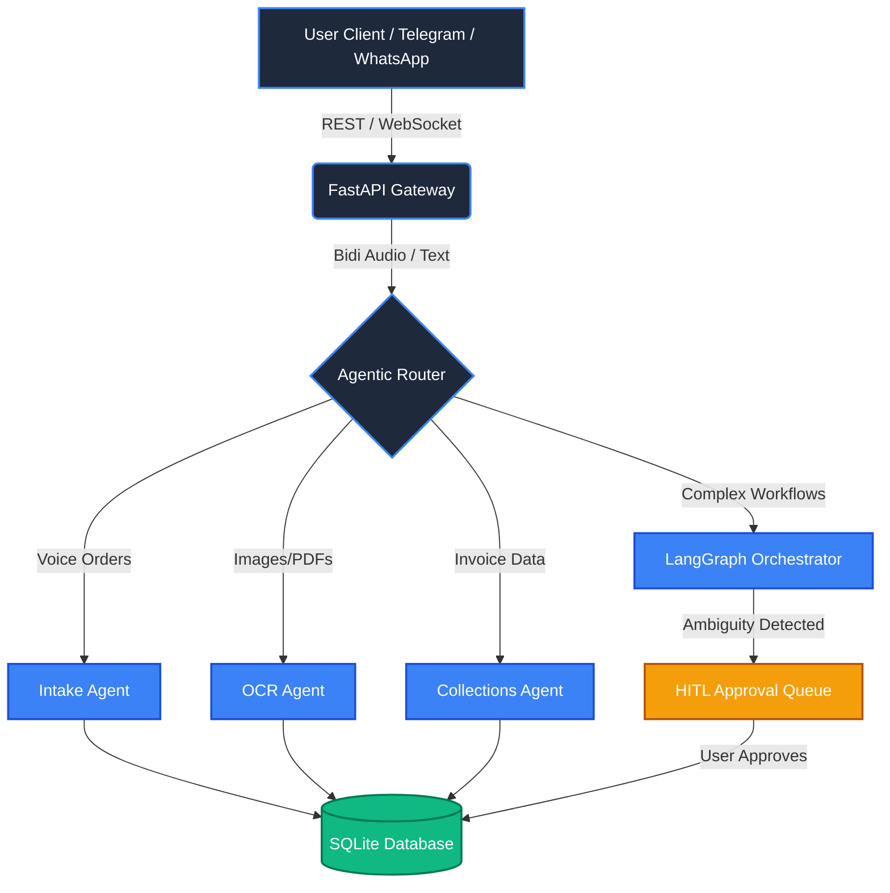
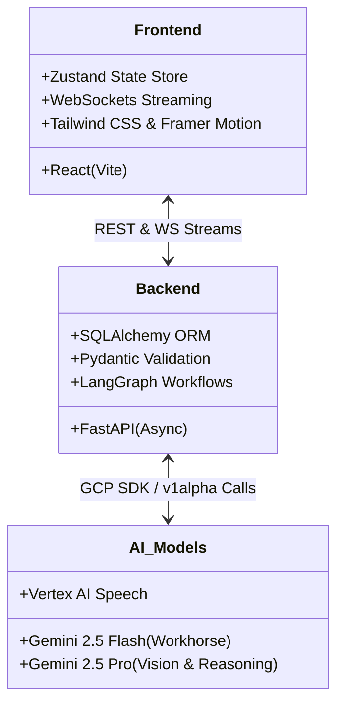

<div align="center">
  <h1>Vyapaar Saarthi</h1>
  <h3>The Next-Generation AI-Native Operating System for Indian MSMEs</h3>
  
  <p>
    
    
    
    
    
    
  </p>

  <p>
  Powered by vishal
    Powered by <b>Google Gemini 2.5 Pro & Flash</b> - <b>Vertex AI</b> - <b>LangGraph</b> - <b>FastAPI</b> - <b>React</b>
  </p>
</div>

---

## Enterprise Vision

Vyapaar Saarthi is a mission-critical, modular AI agent platform designed specifically for Indian Micro, Small, and Medium Enterprises (MSMEs). It transcends traditional chatbots by offering an ecosystem of independently callable, state-aware AI Agents orchestrated via LangGraph. 

From processing multilingual voice orders and analyzing complex GST documents to mitigating supply chain risks, Vyapaar Saarthi operates as the autonomous central nervous system for your business operations.

---

## Core Features & Agent Capabilities

### 1. The Autonomous Agent Ecosystem
Vyapaar Saarthi operates using a fleet of specialized, independently callable AI Agents:
- **Intake Agent:** Extracts structured data (Products, Quantities, Pricing, Delivery Dates) from unstructured text and natural language queries into type-safe JSON models, powering autonomous order creation.
- **Speech Agent:** Handles voice inputs. Features Gemini Live Bidirectional Voice Streaming for immersive, low-latency conversational AI. It flawlessly parses native Hinglish and regional dialects.
- **OCR & Vision Agent:** Uses Gemini 2.5 Pro Vision to instantly extract structured tabular data from raw WhatsApp screenshots, handwritten receipts, and vendor invoices.
- **Collections Agent:** A deterministic, template-based engine that identifies overdue accounts, calculates risk tiers, and dispatches automated payment reminders (Level 1 Gentle or Level 2 Urgent). It avoids LLM truncation bugs by using a hardcoded template pipeline.
- **LangGraph Orchestrator:** Acts as the master router. It gracefully suspends ambiguous or high-risk workflows, placing them into a Human-in-the-Loop (HITL) queue for manager approval before committing data to the database.

### 2. Multi-Channel Communication (Twilio & Telegram)
- **Twilio Integration:** Utilizes the Twilio WhatsApp Sandbox API for frictionless customer interactions, allowing vendors to place orders via WhatsApp texts or voice notes. Also supports SMS capabilities for critical text-based alerts.
- **Telegram Bot:** A fully integrated, continuous long-polling Telegram Bot. It captures voice notes and text messages, silently saves the `telegram_chat_id` for future routing, and features fast-path introductory handlers for seamless onboarding. 
- **Enterprise Reporting & Invoicing:** Through natural language ("mujhe invoice chahiye" or "download my expenses sheet"), the bot generates and delivers professional PDF tax invoices and dynamically calculated `.xlsx` reports directly to the chat.
- **Cross-Platform Delivery:** The system dynamically routes outbound messages (like collection reminders) natively to the platform where the order originated, prioritizing Telegram DMs or falling back to Twilio WhatsApp seamlessly.

### 3. Enterprise Dashboard & Real-Time Sync
- **Real-Time Streaming UI:** Event-driven architecture using WebSockets for a sub-second, token-by-token "Typewriter" streaming experience across the React dashboard.
- **Company Profile Management:** A secure, validated React settings module to manage business identity (GSTIN, Phone, Address) which dynamically syncs with the PDF Invoice Generation engine.
- **Voice Agent Business Context:** The `VoiceAgent` dynamically pulls live financial data, including real-time expenditures and order revenue, providing accurate voice responses to "What are my total expenses this month?"
- **1-Click Fulfillment Tracking:** A "Mark as Paid" capability within the dashboard allows administrators to clear out fulfilled debts immediately, syncing the database and updating overall collection statistics in real-time.

---

## Architecture Design

### Agentic Orchestration Flow



### Modular Component Architecture



---

## Quick Start

### Prerequisites
- Python 3.12+
- Node.js 20+
- Gemini API Key (or GCP project with Vertex AI Application Default Credentials)
- Twilio Account SID and Auth Token (for WhatsApp)
- Telegram Bot API Token

### 1. Backend Setup

```bash
cd backend

# Create virtual environment
python -m venv venv
venv\Scripts\activate  # Windows
# source venv/bin/activate  # macOS/Linux

# Install dependencies
pip install -r requirements.txt

# Configure environment
cp .env.example .env
# Edit .env and set GEMINI_API_KEY, TELEGRAM_BOT_TOKEN, and TWILIO configs

# Start server
uvicorn app.main:app --reload --port 8000

# Start Telegram Bot (in a new terminal)
python -m app.integrations.telegram.bot
```

### 2. Frontend Setup

```bash
cd frontend

npm install
npm run dev
```

Open **http://localhost:5174**

---

## Enterprise API Endpoints

| Method | Path | Description |
|--------|------|-------------|
| WS | `/ws/live` | Gemini Live Bidirectional Streaming Connection |
| POST | `/api/intake` | Parse unstructured order text into DB objects |
| GET | `/api/orders` | Retrieve paginated global order book |
| POST | `/api/orders/{id}/fulfill` | Mark a specific order as COMPLETED |
| POST | `/api/ocr/extract` | Perform deep OCR on file uploads |
| POST | `/api/voice/chat` | Fallback REST standard chat with intent routing |
| GET | `/api/hitl/pending` | Fetch workflows awaiting human approval |
| POST | `/api/collections/mark-paid/{id}` | Clear overdue invoices via the dashboard |
| WS | `/ws` | Subscribe to global agent and order events |

---

## Scalability: Adding New Agents

Vyapaar Saarthi uses a strictly decoupled agent architecture. To add a new agent:

1. Create `agents/new_agent/` with `agent.py`, `prompt.py`, `schemas.py`.
2. Extend `BaseAgent` and implement the `invoke()` method.
3. Wire the endpoint in `routers/new_agent.py` and register in `app/main.py`.
4. (Optional) Add the agent as a node in `graph/nodes.py` for complex HITL workflows.
5. Provide standard React UI cards in the Frontend.

The modular architecture ensures zero structural regression when expanding the system.

---

## Production Deployment

```bash
# Build and push backend container
docker build -t gcr.io/PROJECT_ID/vyapaar-backend ./backend
docker push gcr.io/PROJECT_ID/vyapaar-backend

# Deploy to Cloud Run
gcloud run deploy vyapaar-backend \
  --image gcr.io/PROJECT_ID/vyapaar-backend \
  --platform managed \
  --region us-central1 \
  --allow-unauthenticated
```
