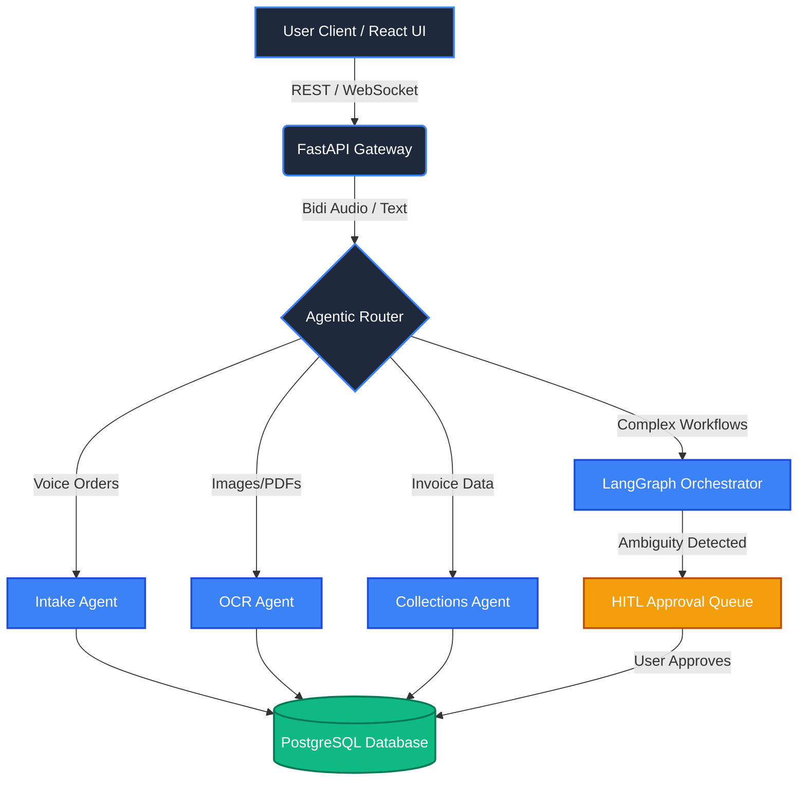
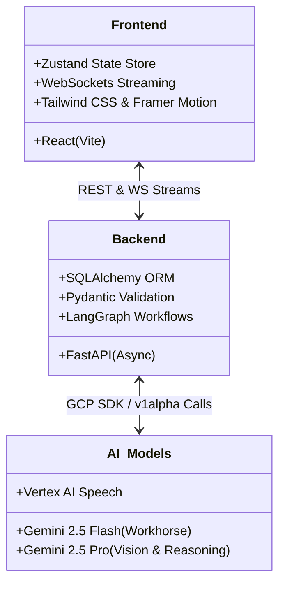

<div align="center">
  
  <h1>Vyapaar Saarthi 🚀</h1>
  <h3>The Next-Generation AI-Native Operating System for Indian MSMEs</h3>
  <p>
    Powered by <b>Google Gemini 2.5 Pro & Flash</b> · <b>Vertex AI</b> · <b>LangGraph</b> · <b>FastAPI</b> · <b>React</b>
  </p>
</div>

---

## 🎯 Enterprise Vision

Vyapaar Saarthi is a **mission-critical, modular AI agent platform** designed specifically for Indian Micro, Small, and Medium Enterprises (MSMEs). It transcends traditional chatbots by offering an ecosystem of independently callable, state-aware AI Agents orchestrated via LangGraph. 

From processing multilingual voice orders and analyzing complex GST documents to mitigating supply chain risks, Vyapaar Saarthi operates as the autonomous central nervous system for your business operations.

---

## 🌟 Core Features

- **🎙️ Gemini Live Bidirectional Voice Streaming:** Fully immersive, low-latency conversational AI that interfaces directly with your business database in real-time.
- **🗣️ Native Hinglish & Regional Parsing:** Robust NLP engine that flawlessly understands Devanagari script ("ऑर्डर प्लेस कर दो"), regional dialects, and mixed-language business vernacular.
- **🧾 Autonomous Order Management:** Background agents extract Products, Quantities, Pricing, and Delivery Dates from unstructured voice notes into strict, type-safe JSON schemas.
- **👁️ Vision & OCR Intelligence:** Extract structured data instantly from raw WhatsApp screenshots, handwritten receipts, and vendor invoices using **Gemini 2.5 Pro Vision**.
- **🛡️ Human-in-the-Loop (HITL):** LangGraph orchestration gracefully suspends ambiguous or high-risk workflows for manager approval before committing to the database.
- **⚡ Real-Time Streaming UI:** Event-driven architecture using WebSockets for a sub-second, token-by-token "Typewriter" streaming experience across the dashboard.

---

## 🏗️ Architecture Design

### Agentic Orchestration Flow



### Modular Component Architecture



---

## ⚡ Quick Start

### Prerequisites
- Python 3.12+
- Node.js 20+
- Gemini API Key (or GCP project with Vertex AI Application Default Credentials)

### 1. Backend Setup

```bash
cd backend

# Create virtual environment
python -m venv venv
venv\Scripts\activate  # Windows
# source venv/bin/activate  # macOS/Linux

# Install dependencies
pip install -r requirements.txt

# Configure environment
cp .env.example .env
# Edit .env and set GEMINI_API_KEY or GCP_PROJECT_ID

# Start server
uvicorn app.main:app --reload --port 8000
```

### 2. Frontend Setup

```bash
cd frontend

npm install
npm run dev
```

Open **http://localhost:5174**

---

## 📡 Enterprise API Endpoints

| Method | Path | Description |
|--------|------|-------------|
| `WS` | `/ws/live` | **Gemini Live Bidirectional Streaming Connection** |
| `POST` | `/api/intake` | Parse unstructured order text into DB objects |
| `GET` | `/api/orders` | Retrieve paginated global order book |
| `POST` | `/api/orders/{id}/fulfill` | Mark a specific order as COMPLETED |
| `POST` | `/api/ocr/extract` | Perform deep OCR on file uploads |
| `POST` | `/api/voice/chat` | Fallback REST standard chat with intent routing |
| `GET` | `/api/hitl/pending` | Fetch workflows awaiting human approval |
| `WS` | `/ws` | Subscribe to global agent and order events |

---

## 🔌 Scalability: Adding New Agents

Vyapaar Saarthi uses a strictly decoupled agent architecture. To add a new agent:

1. Create `agents/new_agent/` with `agent.py`, `prompt.py`, `schemas.py`.
2. Extend `BaseAgent` and implement the `invoke()` method.
3. Wire the endpoint in `routers/new_agent.py` and register in `app/main.py`.
4. (Optional) Add the agent as a node in `graph/nodes.py` for complex HITL workflows.
5. Provide standard React UI cards in the Frontend.

The modular architecture ensures **zero structural regression** when expanding the system.

---

## 🌐 Production Deployment

```bash
# Build and push backend container
docker build -t gcr.io/PROJECT_ID/vyapaar-backend ./backend
docker push gcr.io/PROJECT_ID/vyapaar-backend

# Deploy to Cloud Run
gcloud run deploy vyapaar-backend \
  --image gcr.io/PROJECT_ID/vyapaar-backend \
  --platform managed \
  --region us-central1 \
  --allow-unauthenticated
```
